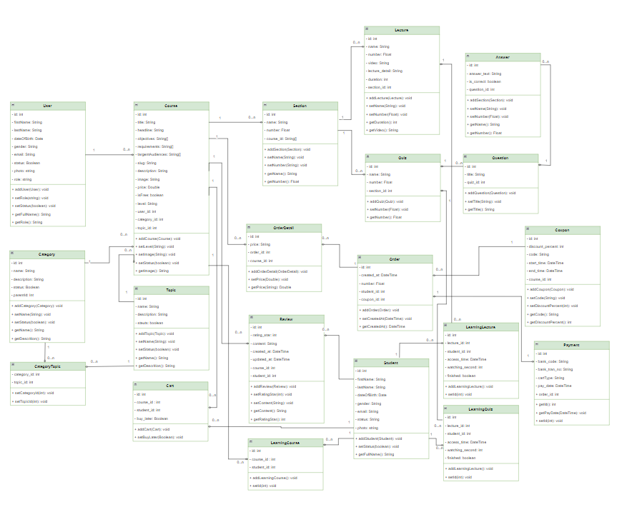

# Elearning website

## Table of Contents

- [Overview](#overview)
- [Features](#features)
- [Technologies Used](#technologies-used)
    - [Backend (elearning-api)](#backend-book-social-network)
    - [Frontend (elearning-ui)](#frontend-book-social-network-ui)
- [License](#license)
- [Getting Started](#getting-started)
- [Contributors](#contributors)
- [Acknowledgments](#acknowledgments)

## Overview

Elearning website is a full-stack application that enables student to search, buy and learn course online, meanwhile admin or instructor can create their courses. It offers features such as user registration, profile management . The application ensures security using JWT tokens and adheres to best practices in REST API design. The backend is built with Spring Boot 3 and Spring Security 6, while the frontend is developed using ReactJS with Antd design for styling.

## Features

- User Registration: Users can register for a new account.
- Course search: Users can filer course by rating star, category,..
- Cart management, Learning-course management, Profile management
- Handle login sso with google
- Hanlde payment for course with VNPAY sanbox
- Course, category, user, topic, order, review, student management
- Revenue by time (range day, month, year).
  

#### Class diagram

#### Usecasae diagram

#### Sequence pipeline

## Technologies Used

### Backend (book-network)

- Spring Boot 3
- Spring Security 6
- JWT Token Authentication
- Spring Data JPA
- JSR-303 and Spring Validation
- OpenAPI and Swagger UI Documentation
- Docker
- GitHub Action

### Frontend (book-network-ui)

- ReactJs
- Component-Based Architecture
- Antd design

## License

This project is licensed under the Apache License 2.0. See the [LICENSE](LICENSE) file for details.

## Getting Started

To get started with the Book Social Network project, follow the setup instructions in the respective directories:

- [Backend Setup Instructions](/book-network/README.md)
- [Frontend Setup Instructions](book-network-ui/README.md)

## Contributors

- [NGO DUC THUAN](https://github.com/guma2k2)

## Acknowledgments

Special thanks to the developers and maintainers of the technologies used in this project. Their hard work and dedication make projects like this possible.
