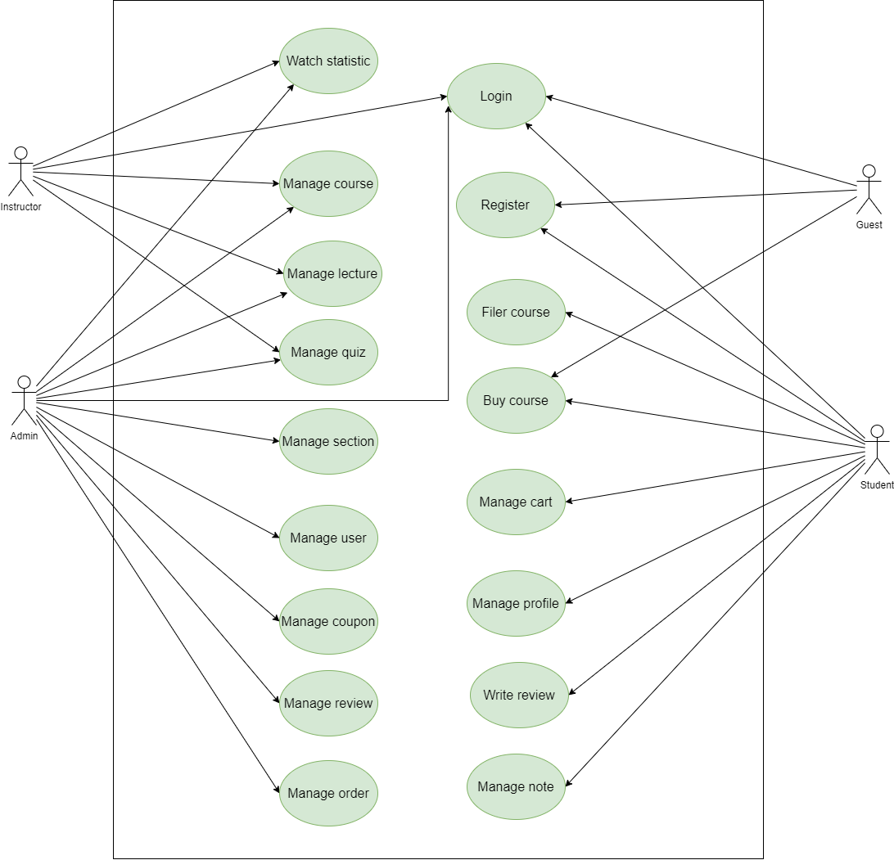
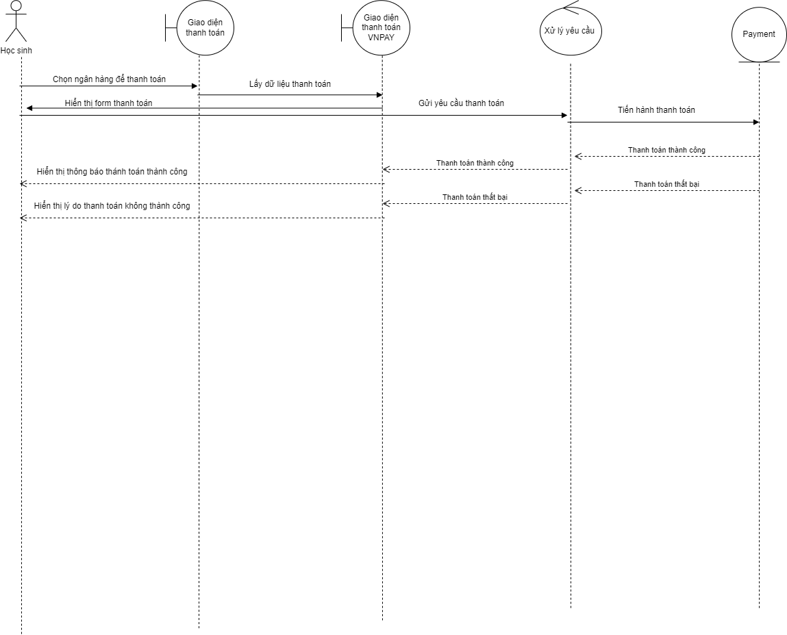

# Elearning website

## Table of Contents

- [Overview](#overview)
- [Features](#features)
- [Technologies Used](#technologies-used)
    - [Backend (elearning-api)]
    - [Frontend (elearning-ui)]
- [License](#license)
- [Getting Started](#getting-started)
- [Contributors](#contributors)
- [Acknowledgments](#acknowledgments)

## Overview

The Elearning website is a comprehensive full-stack application designed to facilitate online learning. Students can search for, purchase, and take courses, while admins or instructors can create and manage their content. Key features include user registration with Google SSO, secure payments via VNPAY sandbox, and robust security measures using JWT tokens. The application follows best practices in REST API design, with the backend powered by Spring Boot 3 and Spring Security 6, and the frontend developed using ReactJS with Ant Design for styling.

## Features
- User Registration: Users can easily create a new account.
- Course Search: Users can filter courses by rating, category, and more.
- Management: Includes cart management, learning-course tracking, and profile customization.
- Google SSO Login: Streamlined login using Google Single Sign-On.
- Payment Processing: Secure course payments via VNPAY sandbox.
- Comprehensive Management: Manage categories, users, topics, orders, reviews, coupons, and students.
- Course Management: Create and organize courses with sections, lectures, and quizzes.
- Analytics: View statistics by custom date ranges, including daily, monthly, and yearly reports.
  
#### Class diagram

#### Usecasae diagram

#### Sequence diagram

## Technologies Used

### Backend (elearning-be)

- Spring Boot 3
- Spring Security 6
- JWT Token Authentication
- Spring Data JPA
- JSR-303 and Spring Validation
- OpenAPI and Swagger UI Documentation
- Docker
- GitHub Action

### Frontend (elearning-fe)

- ReactJs
- Component-Based Architecture
- Antd design

## License

This project is licensed under the Apache License 2.0. See the [LICENSE](LICENSE) file for details.

## Getting Started

To get started with the Book Social Network project, follow the setup instructions in the respective directories:

- [Backend Setup Instructions](/book-network/README.md)
- [Frontend Setup Instructions](book-network-ui/README.md)

## Contributors

- [NGO DUC THUAN](https://github.com/guma2k2)

## Acknowledgments

Special thanks to the developers and maintainers of the technologies used in this project. Their hard work and dedication make projects like this possible.
