# Elearning website

## Table of Contents

- [Overview](#overview)
- [Features](#features)
- [Demo](#demo)
- [User interfaces](#user-interfaces)
- [Technologies Used](#technologies-used)
    - [Backend](#backend)
    - [Frontend](#frontend)
- [License](#license)
- [Getting Started](#getting-started)
- [Contributors](#contributors)

## Overview

The Elearning website is a comprehensive full-stack application designed to facilitate online learning. Students can search for, purchase, and take courses, while admins or instructors can create and manage their content. Key features include user registration with Google SSO, secure payments via VNPAY sandbox, and robust security measures using JWT tokens. The application follows best practices in REST API design, with the backend powered by Spring Boot 3 and Spring Security 6, and the frontend developed using ReactJS with Ant Design for styling.

## Features
- User Registration: Users can easily create a new account.
- Course Search: Users can filter courses by rating, category, and more.
- Management: Includes cart management, learning-course tracking, and profile customization.
- Google SSO Login: Streamlined login using Google Single Sign-On.
- Payment Processing: Secure course payments via VNPAY sandbox.
- Comprehensive Management: Manage categories, users, topics, orders, reviews, coupons, and students.
- Course Management: Create and organize courses with sections, lectures, and quizzes.
- Analytics: View statistics by custom date ranges, including daily, monthly, and yearly reports.

## Technologies Used

### Backend 

- Spring Boot 3
- Spring Security 6
- JWT Token Authentication
- Spring Data JPA
- JSR-303 and Spring Validation
- OpenAPI and Swagger UI Documentation
- Docker
- GitHub Action

### Frontend 

- ReactJs
- Component-Based Architecture
- Antd design
- Link github: https://github.com/guma2k2/elearning_ui
## Demo
- Link: https://youtu.be
## User interfaces
- Ideas from https://www.udemy.com and https://fullstack.edu.vn .
### For Guest

#### Login page
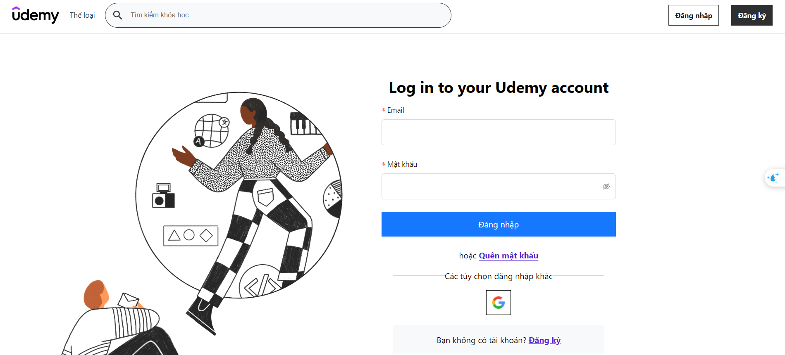

#### Filter course page
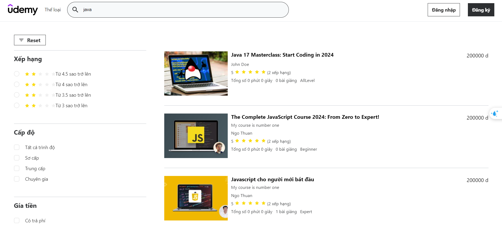

### For Student

#### Home page
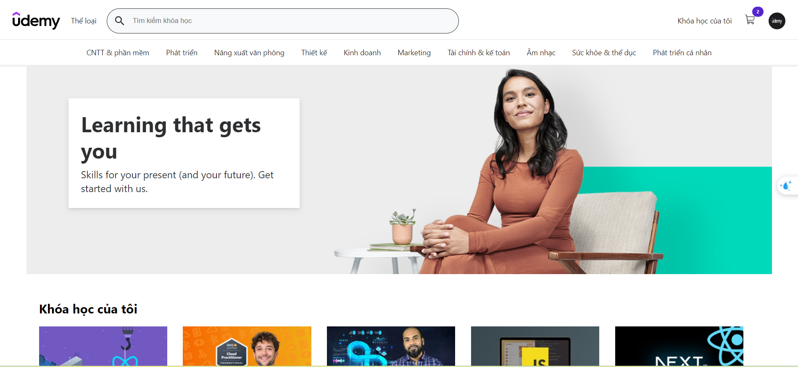

#### Cart page
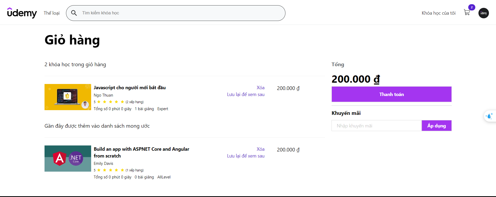

#### Payment page
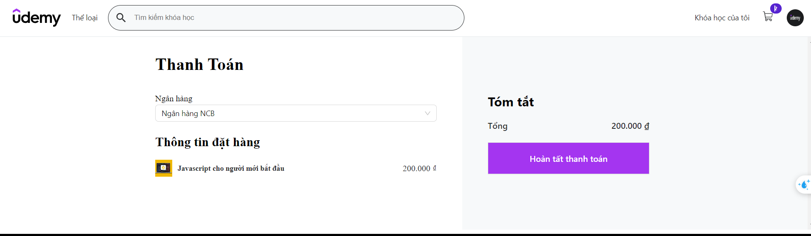

#### Learning page
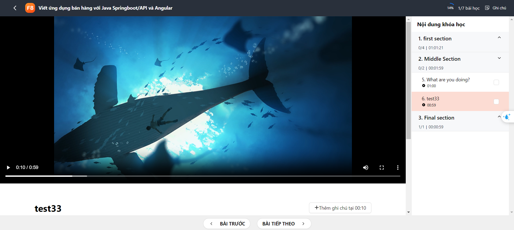

### For Admin 

#### Dashboard page
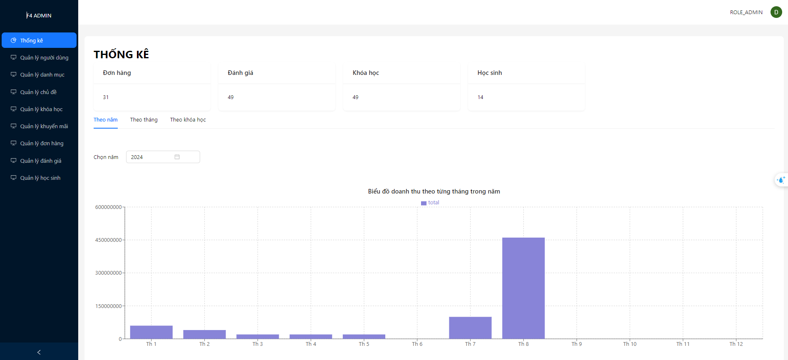

#### Manage course page
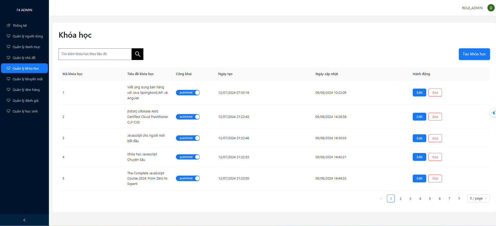

#### Edit course page
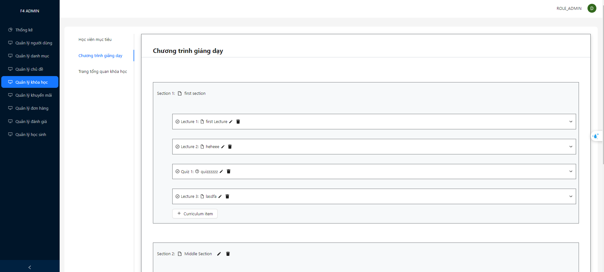

### For Instructor

### Dashboard page 
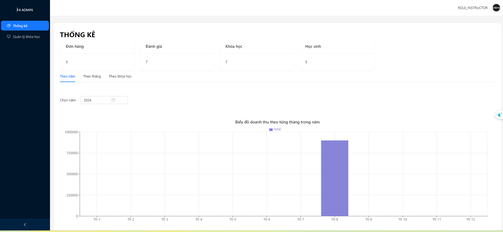

### Manage course page
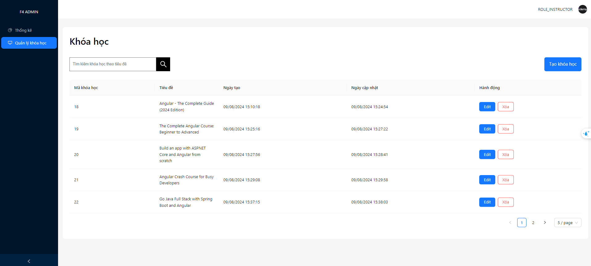

## System design

#### Class diagram

#### Usecasae diagram

## License

This project is licensed under the Apache License 2.0. See the [LICENSE](LICENSE) file for details.
If you have any improvement or weird things about my project, please send an email to thuanngo3072002@gmail.com. Thank you so much.

## Getting Started

To get started with the Elearning project, follow the setup instructions in the respective directories:
- Clone this project
- Run cmd : docker compose up -d --build
- Access link:  http://localhost

## Contributors

- [NGO DUC THUAN](https://github.com/guma2k2)

